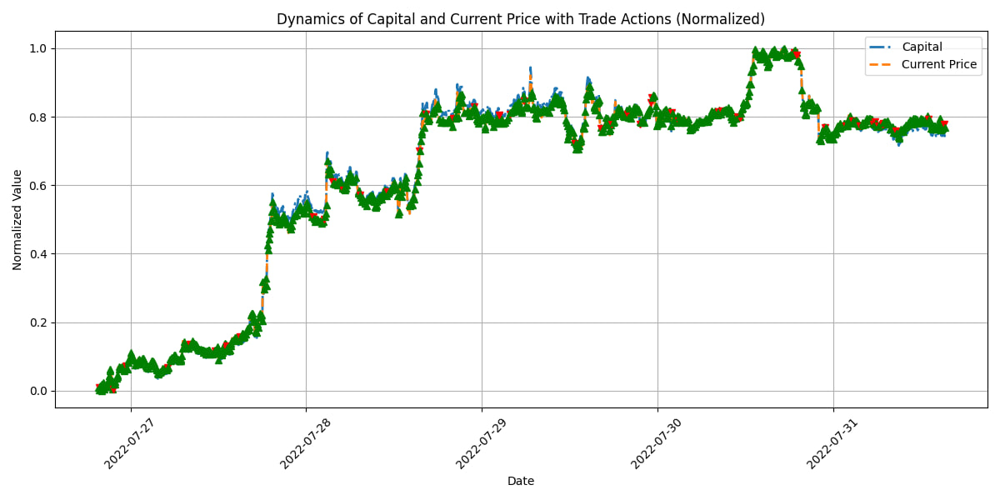
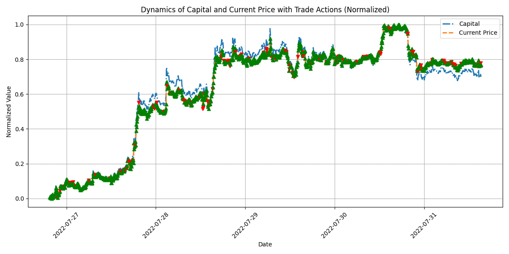
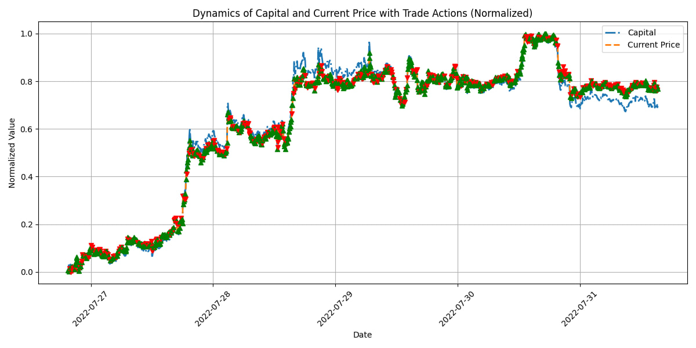

# PPO Торговый Агент для Криптовалюты Bitcoin

Этот репозиторий содержит код для обучения и тестирования агента с использованием метода Proximal Policy Optimization (PPO) для торговли криптовалютой Bitcoin.

## Описание

`main.py` содержит полный пайплайн для обработки данных, обучения PPO агента и тестирования его производительности на исторических данных. Обучение происходит на основе данных о ценах Bitcoin, используя методы обучения с подкреплением для оптимизации торговых стратегий.

## Установка

Для запуска проекта необходимо установить следующие зависимости:
- `torch`: для работы с нейронными сетями.
- `matplotlib`: для визуализации результатов.

Вы можете установить все необходимые зависимости, используя команду:

```pip install torch matplotlib```


## Использование

Чтобы начать обучение и тестирование агента, выполните следующую команду:

```python main.py```


## Структура Проекта

- `components/` - содержит модули необходимые для работы агента:
  - `data/` - обработка и подготовка данных.
  - `trading_gym/` - среда для тестирования торговых стратегий.
  - `agent/` - реализация агента PPO.
  - `utils/` - вспомогательные инструменты, такие как функция для визуализации результатов.

- `data.json` - файл с историческими данными о ценах Bitcoin.

## Как это работает

1. Данные загружаются и предварительно обрабатываются.
2. Инициализируется торговая среда с обучающим и тестовым наборами данных.
3. Создается и обучается агент PPO.
4. Тестируется производительность агента на исторических данных.
5. Визуализируются результаты торговых сессий.


## Визуализация Результатов

Ниже представлены графики, иллюстрирующие динамику капитала и текущей цены Bitcoin во время тестовых торговых сессий, а также действия торгового агента.




